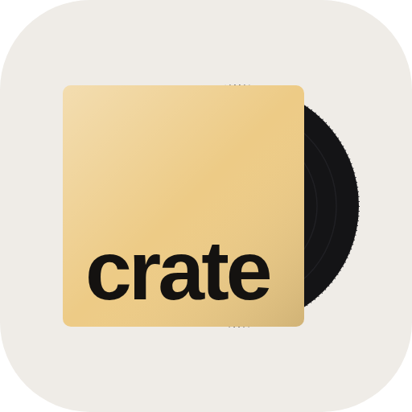

<p align="center"></p>

# Crate

Send songs to friends as vinyl records.

Paste a Spotify or Apple Music link and Crate turns it into a sealed record. Send it by text, WhatsApp,
Telegram, email, X, or your phone's share sheet. Your friend opens the link, taps the sleeve, and the
record slides out and starts to spin. Then they can play it on Spotify or Apple Music, or save it in
Crate.

It's a web app: it works in any browser, and on iPhone or Android you can add it to your home screen
(Share → Add to Home Screen) so it opens like an app.

## How it works

- **Make:** paste a link to one song. Add who it's for, your name and an optional note, then **Send
  record**: a sheet offers your phone's share list (Messages, WhatsApp, AirDrop…) or Copy link.
  Recently Sent shows each record as **Sealed** or **Opened**, and a badge on the Records tab counts
  records opened since you last looked.
- **Records:** the records you've sent, and the ones friends sent you that you saved. They're kept in
  this browser. Sign in with your email (optional, no password: a 6-digit code) and they follow you to
  every phone and computer; records sent before signing in move into the account.
- **The record page:** your friend taps the sleeve, the record slides out and spins, and Apple's
  30-second preview starts playing. Then they can open it in Spotify or Apple Music, or save it.
- **Library (optional):** connect Spotify to send songs straight from your liked songs, recently played
  and playlists.
- **The record link** carries the song, artist, cover, note and the Spotify / Apple Music IDs, so it
  opens anywhere even if the database is down. Links made by the Vinyl Player Mac app open here too.

Songs are looked up in the browser: first [song.link](https://odesli.co), then Apple's iTunes catalogue
and Spotify's public embed info. If none of them answer, Crate asks you to type the title and artist.

## Put it online (GitHub Pages)

1. In this repo: **Settings → Pages → Source: GitHub Actions**.
2. Push to `main`. The **Publish Crate** workflow puts the site at
   `https://<your-username>.github.io/crate/`.

## Database (Supabase)

Crate uses a Supabase project only to know which records have been opened. Each browser that sends a
record gets an anonymous identity automatically: no sign-up, no email.

1. In Supabase: **Authentication → Sign In / Providers → Allow anonymous sign-ins** (on).
2. **SQL Editor → New query**, paste all of [`supabase/schema.sql`](supabase/schema.sql), **Run**.
3. Run [`supabase/accounts.sql`](supabase/accounts.sql) the same way (email sign-in and saved records).
4. Put the project URL and the **anon / publishable** key in `config.js`.

For email sign-in:

- Sign-in works with Supabase's default emails (tap the link in them). To also show a code people can
  type (better for the home-screen app), set up SMTP below first; Supabase only lets you edit
  **Authentication → Emails → Templates** after that. Then add
  `<p>Your Crate code: <strong>{{ .Token }}</strong></p>` to **Magic Link** and **Confirm signup**.
- **Authentication → URL Configuration → Site URL:** your Crate address (e.g. `https://crate-three-mu.vercel.app/`).
- Supabase's built-in email only reaches your own team's addresses and sends a few an hour. For everyone
  else, set up your own sender under **Project Settings → Authentication → SMTP Settings** (e.g. Resend,
  or a Gmail account with an app password).

What's stored per record: a random id, who it's to and from (the names typed in), the song, the note,
and when it was first opened and how many times. Senders can only read their own records. Anyone with a
record's link can mark it opened, and nothing else. Never put the `service_role` / secret key anywhere
in this repo.

## Connect Spotify (optional)

1. Go to <https://developer.spotify.com/dashboard> and create an app (any name). Tick **Web API**.
2. Under **Redirect URIs**, add your Crate address exactly, e.g. `https://azhaf7.github.io/crate/`.
3. Copy the **Client ID** into `config.js` (`spotifyClientId: '…'`) and push.

Crate signs in with PKCE, so no Client Secret is needed. Never put the secret in this repo. While a
Spotify app is in development mode, only people you add under **User Management** (up to 25) can
connect; ask Spotify for an extension to open it to everyone.

## Files

```
index.html, app.css, app.js   The app: Make, Records, Library
stack.js, stack.css           The sleeve stack on Records, the Library source cards
r/                            The record page friends open (same motion as Vinyl Player's)
config.js                     Supabase URL + anon key, Spotify Client ID (optional)
supabase/schema.sql           The database: records, who can see them, open receipts
supabase/accounts.sql         Email sign-in: saved records per account, moving records into an account
manifest.webmanifest, sw.js   Add to home screen, works on a poor connection
```
